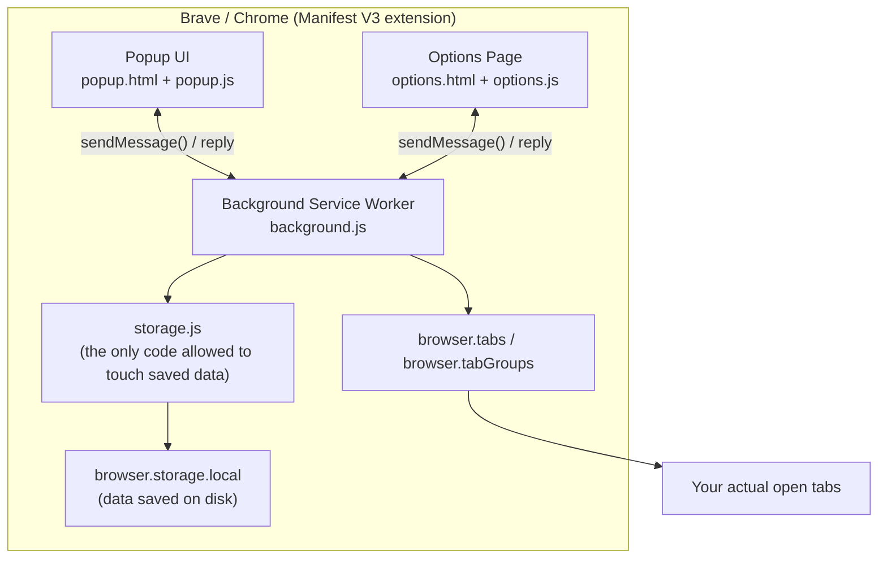
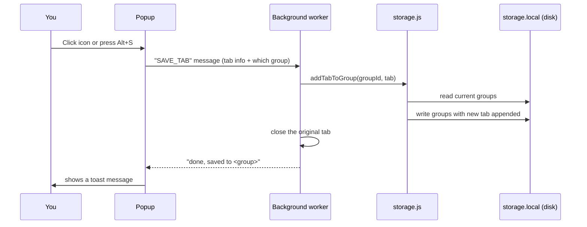
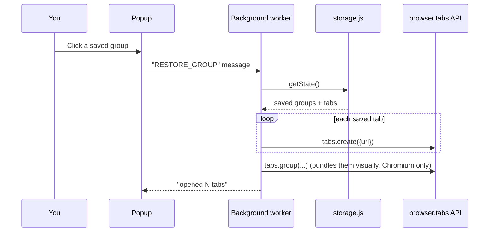

# Tab Stash

A Manifest V3 extension for saving and restoring collections of tabs — an
extension-managed "shelf" of tab groups, separate from (and never touching)
the browser's own native tab-group feature.

## Install (Chrome / Brave / Edge / Opera)

1. Visit `chrome://extensions` (or the equivalent `brave://extensions`,
   `edge://extensions`, `opera://extensions`).
2. Enable **Developer mode**.
3. Click **Load unpacked** and select this project's root folder (the one
   containing `manifest.json`).

## Install (Firefox — best effort)

Firefox needs a different `background` key (`scripts` instead of
`service_worker`) and a `browser_specific_settings.gecko.id`. Build the
Firefox-flavored copy, then load it as a temporary add-on:

```
npm install
npm run build:firefox
```

Then visit `about:debugging#/runtime/this-firefox` → **Load Temporary
Add-on…** → select `dist-firefox/manifest.json`.

Firefox has no `tabGroups` API, so restored tabs open adjacent to each other
in saved order instead of inside a native colored group (see "Cross-browser
behavior" below).

## Using it

- **Save the current tab** — click the toolbar icon, or press `Alt+S`. A
  picker lists your groups (type to filter); pick one, or select **+ New
  group** and name it. The tab is saved and closed (pinned tabs are saved but
  left open).
- **Restore a group** — press `Alt+O` for a quick picker, or open the toolbar
  icon → **My Groups** and click a group / its ▶ button. Saved tabs open in
  the current window; on Chromium browsers they're placed into a native tab
  group colored/labeled to match. The saved group stays in storage by default
  so it can be reopened later (configurable in Options).
- **Manage groups** — toolbar icon → **My Groups**: search, rename, delete
  groups, expand a group to remove individual tabs or reorder them.
- **Shortcuts** — actual key bindings are owned by the browser, not the
  extension. Change them from Options → "Configure shortcuts…", which links
  to `chrome://extensions/shortcuts` (or Firefox's `about:addons` → gear icon
  → "Manage Extension Shortcuts").
- **Backup** — Options → Export/Import JSON. Import merges groups into your
  existing data (assigns fresh IDs); it never deletes what you already have.

## Data model

Stored in `chrome.storage.local` (see `src/lib/storage.js`):

```js
{
  groups: [
    {
      id, name, color, createdAt, updatedAt,
      tabs: [{ id, url, title, favIconUrl, savedAt }]
    }
  ],
  settings: { clearOnOpen: false }
}
```

`storage.local` is used instead of `storage.sync` because sync has an 8KB
per-item / 100KB total quota that a handful of saved tab groups (with
favicon URLs and titles) will exceed quickly.

## Cross-browser behavior

All browser API calls go through `webextension-polyfill` (vendored at
`src/lib/browser-polyfill.js`), so the code uses `browser.*` uniformly. Native
tab-group restoration feature-detects `browser.tabGroups`/`browser.tabs.group`
at runtime rather than sniffing the browser name — if it's missing (Firefox
today; possibly other browsers in the future), tabs are opened adjacent and
in order with no error, just without the colored group wrapper.

## Architecture notes

### Components and data flow

The popup and options page never touch storage or tabs directly — they send
a message (e.g. `{type: "SAVE_TAB", ...}`) to the background service worker
and wait for a reply. The background worker is the only code that reads/writes
saved data or opens/closes/groups real tabs, which avoids read-modify-write
races if multiple UI surfaces are open at once.



Saving a tab (`Alt+S`):



Restoring a group:



- All storage mutations happen in the background service worker
  (`src/background.js` + `src/lib/storage.js`); the popup and options page
  only send `runtime.sendMessage` requests and re-fetch state afterward. This
  avoids read-modify-write races between multiple UI surfaces writing to
  storage concurrently.
- `Alt+S` / `Alt+O` can't reliably reopen the browser-action popup
  programmatically across browsers, so those commands instead open a small
  dedicated `popup.html?mode=save|open` window via `windows.create`. The
  window that should receive restored tabs is captured _before_ that popup
  window is created and threaded through explicitly (`windowId` query
  param → `RESTORE_GROUP` message) — otherwise, by the time the user picks a
  group, "the current window" would resolve to the small picker window
  itself instead of the user's real browser window.
